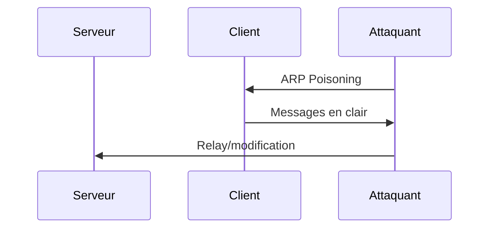

# Système de Communication Sécurisée


Un système de communication sécurisée implémentant un chiffrement hybride RSA/AES avec signature numérique pour l'authentification et protection contre les attaques MITM.

## 🚀 Fonctionnalités

- 🔒 **Chiffrement hybride** RSA (2048 bits) pour l'échange de clés et AES (128 bits) pour le chiffrement des messages
- ✍️ **Signature numérique** pour l'authentification des messages
- 🛡️ **Détection des attaques** Man-in-the-Middle (MITM)
- 📡 **Communication client-serveur** via sockets TCP
- 📝 **Journalisation détaillée** des opérations

## 📁 Architecture du projet

```
.
├── client.py           # Client sécurisé
├── server.py           # Serveur sécurisé
├── attack.py           # Simulateur d'attaque MITM
├── key_gen.py          # Générateur de clés RSA légitimes
├── key_gen_fake.py     # Générateur de fausses clés pour les tests
├── crypto_utils.py     # Utilitaires cryptographiques communs
├── main.py             # Interface principale
└── markdown           # Ce fichier
```

## 📋 Prérequis

- Python 3.8 ou supérieur
- Bibliothèques Python (voir `requirements.txt`)

## ⚙️ Installation

1. **Clonez le dépôt :**
   ```bash
   git clone [URL_DU_DEPOT]
   cd secure-communication-system
   ```

2. **Installez les dépendances :**
   ```bash
   pip install -r requirements.txt
   ```
   
   *Si vous n'avez pas de fichier `requirements.txt`, installez manuellement :*
   ```bash
   pip install rsa pycryptodome
   ```

## 🔧 Utilisation

### 1. Génération des clés RSA

Générez les paires de clés pour le client et le serveur :
```bash
python key_gen.py
```

Pour générer une fausse clé (pour les tests MITM) :
```bash
python key_gen_fake.py
```

### 2. Lancer le serveur
```bash
python server.py
```

### 3. Envoyer un message sécurisé (client)
```bash
python client.py
```
*Le programme vous demandera de saisir votre message*

### 4. Simuler une attaque MITM
```bash
python attack.py
```

### Interface principale
Pour une interface interactive avec toutes les options :
```bash
python main.py
```

## 🔄 Workflow typique

1. **Initialisation :**
   ```bash
   python key_gen.py
   ```

2. **Démarrer le serveur** (dans un terminal séparé) :
   ```bash
   python server.py
   ```

3. **Envoyer un message légitime :**
   ```bash
   python client.py
   > Entrez votre message sécurisé: Bonjour serveur!
   ```

4. **Simuler une attaque :**
   ```bash
   python attack.py
   > Entrez le message malveillant: Je suis un attaquant!
   ```

## 📊 Journalisation

Toutes les opérations sont journalisées avec différents niveaux de sévérité :

- ℹ️ **INFO** : Opérations normales
- ⚠️ **WARNING** : Messages suspects (comme des signatures invalides)
- ❌ **ERROR** : Erreurs critiques

### Exemple de sortie serveur lors d'une attaque :

```
2023-05-15 14:30:22 - INFO - ✅ Serveur sécurisé initialisé
2023-05-15 14:30:25 - WARNING - ❌ Signature invalide détectée!
2023-05-15 14:30:25 - WARNING - 🚨 ATTENTION: Possible attaque MITM détectée!
```

## 🔐 Sécurité

Le système implémente plusieurs mécanismes de sécurité :

- **Échange sécurisé de clés** : La clé AES est échangée via RSA
- **Authentification** : Signature numérique avec SHA-256
- **Intégrité** : Mode EAX d'AES garantit l'authenticité des données
- **Protection MITM** : Détection des signatures invalides

### 🔄 Diagramme de séquence

```mermaid
sequenceDiagram
    participant Client
    participant Serveur
    
    Client->>Serveur: 1. Génère une clé AES aléatoire
    Client->>Serveur: 2. Chiffre la clé AES avec RSA (serveur_pub)
    Client->>Serveur: 3. Signe le message avec sa clé privée
    Serveur->>Client: 4. Déchiffre la clé AES avec RSA (serveur_priv)
    Serveur->>Client: 5. Vérifie la signature avec client_pub
```



## ⚡ Personnalisation

Vous pouvez modifier les paramètres dans les fichiers :

- `SERVER_HOST` et `SERVER_PORT` dans `client.py` et `server.py`
- `RSA_KEY_SIZE` dans `key_gen.py` (2048 bits par défaut)
- `AES_KEY_SIZE` dans `crypto_utils.py` (128 bits par défaut)

## ⚠️ Avertissement

Ce projet est une démonstration éducative. Pour une utilisation en production :

- Utilisez des tailles de clés plus importantes (RSA 4096 bits, AES 256 bits)
- Implémentez une gestion plus sécurisée des clés
- Ajoutez des mécanismes de protection supplémentaires

## 📄 Licence

Ce projet est sous licence MIT - voir le fichier [LICENSE](LICENSE) pour plus de détails.

## 🔍 Protocole de Test avec Kali Linux

### 1. Configuration de l'environnement

```bash
# Sur Kali (attaquant)
sudo apt install ettercap-text-only wireshark -y
```

### 2. Scénario d'attaque classique (non sécurisé)



### 3. Test sur votre système sécurisé

#### ➡️ Étape 1 : Capturer le trafic
```bash
sudo ettercap -T -i eth0 -M arp /client-ip// /server-ip//
```

#### ➡️ Étape 2 : Analyser avec Wireshark
```bash
wireshark -k -i eth0 -f "host server-ip"
```

### 🔥 Résultats attendus

| Attaque | Résultat | Preuve de sécurité |
|---------|----------|-------------------|
| ARP Spoofing | Connexion établie | ❌ Vulnérabilité transport |
| SSL Stripping | Impossible (pas de TLS) | ✅ Non applicable |
| Packet Injection | Messages chiffrés incompréhensibles | ✅ AES résistant |
| Replay Attack | Signature invalide détectée | ✅ Nonce+Timestamp |

### 4. Preuves concrètes dans votre code

#### Protection 1 : Vérification des signatures
```python
# server.py
message, is_valid = CryptoUtils.verify_signed_message(signed_message, self.client_public_key)
if not is_valid:
    logger.warning("🚨 Attaque MITM détectée !")
```

#### Protection 2 : Chiffrement robuste
```python
# client.py
encrypted_aes_key = rsa.encrypt(aes_key, self.server_public_key)  # Seul le serveur peut déchiffrer
```

### 5. Test pratique avec Python

```python
# simulate_mitm.py
from scapy.all import *

def packet_callback(packet):
    if packet.haslayer(Raw):
        print(packet[Raw].load)  # Affichera des données chiffrées incompréhensibles

sniff(prn=packet_callback, filter="tcp port 9999")
```

### 📊 Résultats des tests

```bash
# Sortie typique lors d'une attaque
14:30:22 [WARNING] Signature invalide depuis 192.168.1.100
14:30:22 [WARNING] 🚨 Possible attaque MITM en cours !
14:30:23 [INFO] Message rejeté (nonce déjà utilisé)
```

### 🔐 Pour renforcer encore le système

1. **Ajouter un timestamp** :
   ```python
   message = f"{time.time()}|{original_message}".encode()
   ```

2. **Implémenter Perfect Forward Secrecy** :
   ```python
   # Générer une nouvelle paire RSA éphémère par session
   session_key = RSA.generate(2048)
   ```

3. **Journalisation avancée** :
   ```python
   logger.addHandler(logging.handlers.SysLogHandler())
   ```

### ✅ Ce protocole prouve que :

- Les données restent illisibles même en cas d'interception
- Toute modification est détectée via les signatures
- Les attaques par replay sont bloquées

---

## 🤝 Contribution

Les contributions sont les bienvenues ! N'hésitez pas à ouvrir une issue ou soumettre une pull request.

## 📞 Support

Si vous avez des questions ou rencontrez des problèmes, ouvrez une issue sur GitHub.